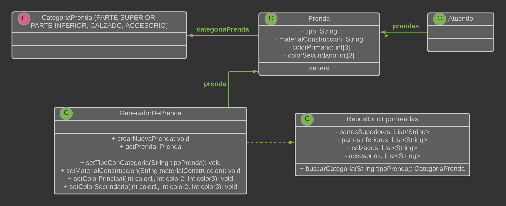

# QMP1-Primera-Iteracion

## Diagrama de clases

<p align="center"> 

</p>


## Explicacion

* La clase "Prenda" tiene estado, pero no tiene comportamiento relevante (por el momento). No se debe poder 
  instanciar clases de "Prenda" directamente, se deben instanciar desde el "GeneradorDePrendas"


* La clase "GeneradorDePrendas" sirve para configurar las instancias de "Prenda" y dejarlas con un estado aceptable 
  para el sistema. Además esta clase permite evitar tener un constructor de "Prenda" con demasiados atributos.
  

* La clase "RepositorioTipoVentas" es un singleton que usamos para tratar de representar lo que sería una petición a
  una base de datos, aunque no sabemos si sería correcto. La idea es que las listas que están en esta clase se puedan 
  persistir y actualizar para poder identificar TIPOS de prendas válidos. Que a su vez nos permite identificar a que
  categoria pertenece una prenda.


## Pseudocodigo

~~~

class Atuendo{
  List<Prenda> prendas
  
}

class Prenda{
  String tipo
  CategoriaPrenda categoria
  String materialConstruccion
  int[] colorPrincipal = new int[3];
  int[] colorSecundario = new int[3];
  
  
  setTipo(String tipo){
    TODO ❕
  }
  
  setCategoria(CategoriaPrenda categoria){
    TODO ❕
  }
  
  setMaterialConstruccion(String materialConstruccion){
    TODO ❕
  }
  
  setColorPrincipal(int color1, int color2, int color3){
    TODO ❕
  }
  
  setColorSecundario(int color1, int color2, int color3){
    TODO ❕
  }
}


enum CategoriaPrenda{
  PARTE-SUPERIOR, CALZADO, PARTE-INFERIOR, ACCESORIO
}

class GeneradorDePrendas{
  Prenda prenda
  
  
  crearNuevaPrenda(){
    prenda = new Prenda();
  }
  
  getPrenda(){
  
    if(!prenda.tipo || !prenda.materialConstruccion || !prenda.colorPrimario){
      throw new exception("La prenda generada no es valida. Debe tener tipo de prenda, material de construccion y color primario")
    }
    
    return prenda;
  }
  
  
  
  
  setTipoConCategoria(String tipoPrenda){
    prenda.setTipo(tipoPrenda)
    CategoriaPrenda categoria = RepositorioTipoPrendas.instance().buscarCategoria(tipo)
    
    prenda.setCategoria(categoria)
  }
  
  setMaterialConstruccion(String materialConstruccion){
    prenda.setMaterialConstruccion(materialConstruccion)
  }
  
  setColorPrincipal(int color1, int color2, int color3){
    prenda.setColorPrincipal(color1, color2, color3)
  }
  
  setColorSecundario(int color1, int color2, int color3){
    prenda.setColorSecundario(color1, color2, color3)
  }
  

}


class RepositorioTipoPrendas{

  private static final RepositorioTipoPrendas INSTANCE = new RepositorioTipoPrendas();
  
  private RepositorioTipoPrendas(){}  //constructor
  
  public static RepositorioTipoPrendas instance(){
    return INSTANCE
  }
  
  List<String> partesSuperiores
  List<String> partesInferiores
  List<String> calzados
  List<String> accesorios
  
  
  buscarCategoria(String tipoPrenda){
    
    if(partesSuperiores.contains(tipoPrenda)) return CategoriaPrenda.PARTE-SUPERIOR
    if(partesInferiores.contains(tipoPrenda)) return CategoriaPrenda.PARTE-INFERIOR
    if(calzados.contains(tipoPrenda)) return CategoriaPrenda.CALZADO
    if(accesorios.contains(tipoPrenda)) return CategoriaPrenda.ACCESORIO
    else{
    	throw new exception("El tipo de prenda ingresado no es valido")
    }
  }
   
}


~~~


---

# Ejecutar tests

```
mvn test
```

# Validar el proyecto de forma exahustiva

```
mvn clean verify
```

Este comando hará lo siguiente:

 1. Ejecutará los tests
 2. Validará las convenciones de formato mediante checkstyle
 3. Detectará la presencia de (ciertos) code smells
 4. Validará la cobertura del proyecto

# Entrega del proyecto

Para entregar el proyecto, crear un tag llamado `entrega-final`. Es importante que antes de realizarlo se corra la validación
explicada en el punto anterior. Se recomienda hacerlo de la siguiente forma:

```
mvn clean verify && git tag entrega-final && git push origin HEAD --tags
```

# Configuración del IDE (IntelliJ)

 1. Tabular con dos espacios: 
 2. Instalar y configurar Checkstyle:
    1. Instalar el plugin https://plugins.jetbrains.com/plugin/1065-checkstyle-idea:
    2. Configurarlo activando los Checks de Google: 
 3. Usar fin de linea unix
    1. En **Settings/Preferences**, ir a a **Editor | Code Style**.
    2. En la lista **Line separator**, seleccionar `Unix and OS X (\n)`.
 
